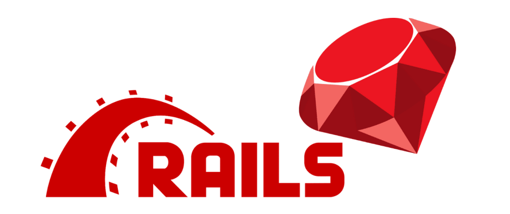

<a name="readme-top"></a>
<h1 align='center'> Rails Blog</h1>



# 📗 Table of Contents

- [📗 Table of Contents](#-table-of-contents)
- [ Rails Blog ](#-My-Blog-App-)
  - [🛠 Built With ](#-built-with-)
    - [Tech Stack ](#tech-stack-)
    - [Key Features ](#key-features-)
  - [💻 Getting Started ](#-getting-started-)
    - [Prerequisites](#prerequisites)
    - [Setup](#setup)
    - [Install](#install)
    - [Database](#database)
    - [Deployment](#deployment)
  - [👥 Authors ](#-authors-)
  - [🔭 Future Features ](#-future-features-)
  - [🤝 Contributing ](#-contributing-)
  - [⭐️ Show your support ](#️-show-your-support-)
  - [🙏 Acknowledgments ](#-acknowledgments-)
  - [📝 License ](#-license-)

<!-- PROJECT DESCRIPTION -->

# Rails Blog <a name="about-project"></a>
> Rails Blog app is a blog website built using Ruby on Rails. Readers can leave comments and like posts, and administrators can manage content. The site includes user authentication and a search feature.

## 🛠 Built With <a name="built-with"></a>
### Tech Stack <a name="tech-stack"></a>

<details>
  <summary>Ruby On Rails</summary>
  <ul>
    <li><a href="">Postgresql</a></li>
  </ul>
</details>

<!-- Features -->

### Key Features <a name="key-features"></a>

- Create and manage blog posts
- See previously posted blogs
- Like or comment on a blog post

<p align="right">(<a href="#readme-top">back to top</a>)</p>

<!-- GETTING STARTED -->

## 💻 Getting Started <a name="getting-started"></a>

To get a local copy up and running, follow these steps.

### Prerequisites

In order to run this project you need:

- Mac or PC
- Understanding OOP principles
- Have the following installed on your machine
    - [Ruby](https://www.ruby-lang.org/en/)
    - [Rails](https://rubyonrails.org/)
    - [PostgreSQL](https://www.postgresql.org/)

### Setup

Clone this repository to your desired folder:

```sh
  cd your-folder
  git clone git@github.com:Besufekad-HAZ/Blog-App.git (SSH)
```

### Install

Install this project with:

Install the required gems with:

```sh
bundle install
```

### Database

Create the databases and run migrations with:

```sh
rails db:create
rails db:migrate
```


### Deployment

To deploy the app you can use

- [Render](https://www.render.com/)
- [Heroku](https://www.heroku.com/)

<p align="right">(<a href="#readme-top">back to top</a>)</p>

<!-- AUTHORS -->

## 👥 Authors <a name="authors"></a>


## <a> 👤 Besufekad Alemu </a>

- GitHub: [@Besufekad-HAZ](https://github.com/Besufekad-HAZ)
- Twitter: [@BesufekadAlemu7](https://twitter.com/BesufekadAlemu7)
- LinkedIn: [@besura](www.linkedin.com/in/besura)

## <a> 👤 Besufekad Alemu </a>

- GitHub: [@Besufekad-HAZ](https://github.com/Besufekad-HAZ)
- Twitter: [@BesufekadAlemu7](https://twitter.com/BesufekadAlemu7)
- LinkedIn: [@besura](www.linkedin.com/in/besura)

👤 **Kelvin kaviku**

- GitHub: [@brainskev](https://github.com/brainskev/)
- Twitter: [@kelvin_ngotho](https://twitter.com/kevin_ngotho?s=09/)
- LinkedIn: [kelvin](https://www.linkedin.com/in/kelvinkaviku/)

<p align="right">(<a href="#readme-top">back to top</a>)</p>

<!-- FUTURE FEATURES -->

## 🔭 Future Features <a name="future-features"></a>

- [ ] **Create API endpoints**
- [ ] **Implement authentication**

<p align="right">(<a href="#readme-top">back to top</a>)</p>

<!-- CONTRIBUTING -->

## 🤝 Contributing <a name="contributing"></a>

Contributions, issues, and feature requests are welcome!

Feel free to check the [issues page](https://github.com/Besufekad-HAZ/Blog-App/issues).

<p align="right">(<a href="#readme-top">back to top</a>)</p>

<!-- SUPPORT -->

## ⭐️ Show your support <a name="support"></a>

If you like this project, please leave a ⭐️

<p align="right">(<a href="#readme-top">back to top</a>)</p>

<!-- ACKNOWLEDGEMENTS -->

## 🙏 Acknowledgments <a name="acknowledgements"></a>

I would like to thank microverse for serving this opprtunity.

<p align="right">(<a href="#readme-top">back to top</a>)</p>

<!-- FAQ (optional) -->

## 📝 License <a name="license"></a>

This project is [MIT](https://github.com/Besufekad-HAZ/Blog-App/blob/main/LICENSE) licensed.

<p align="right">(<a href="#readme-top">back to top</a>)</p>
